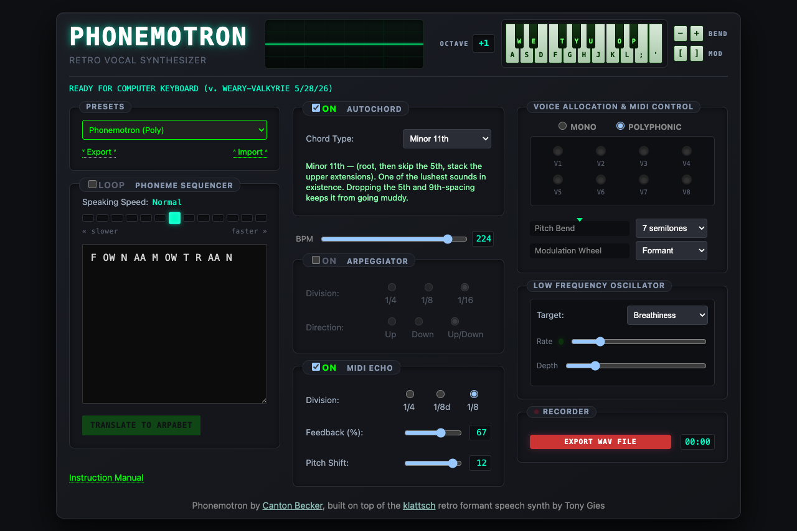

**Source:** <https://cantonbecker.com/phonemotron/> · by Canton Becker, on top of the **klattsch** retro formant speech synth by Tony Gies.

## Identity

Phonemotron is a **formant vocal synthesizer**: a Klatt speech synth you play like an
instrument. You hand it phonemes (ARPABET, e.g. `HH AH L OW` for "hello") and play notes;
each note sings the phoneme string at that pitch. Autochord stacks intervals under one key,
the arpeggiator spreads them, delay echoes them, and an LFO modulates a vocal parameter.
Closer to a *robot choir* than a drone: it is silent until you play it, and the rhythm of
your note on/offs is half the performance.

## What you take away

1. **The listen.** A sung phrase you shaped.
2. **A `.wav` file** of the take, from the app's own `EXPORT WAV FILE` recorder.
3. **A preset object** (`text` + `controls`) that reproduces the sound, plus a **score**
   (the timed note events) that reproduces the performance. Sound + score = the take.
4. **A share bundle** — the `.wav` + the app-native `<label>.preset.txt` + a short README, the
   tool-agnostic, hand-off-able subset. The automation stays with you; see *share*.

## Modes

Two modes, split by **who operates the instrument** — and the divide is browser-runner:

1. **learning** — teach a human to play it at the GUI. The natural, simple version; needs
   nothing but the URL. **No browser-runner.**
2. **AI-driven** — the AI operates the page via **browser-runner** (Playwright). That is what
   unlocks full expressive control. There are two *ways to use it*: a **take** (render a
   sample) and **streaming** (continuous audio over time). These are uses, not separate modes.

The goal of both: a new session or AI model loads this skill and can communicate with the
instrument immediately.

### learning (human-driven, no browser-runner)

The simple version: human at the GUI, Claude narrates. Requires only the URL — no
browser-runner, no Playwright. For this instrument, learning mode is **a flat list of
everything known about it** — read it top to bottom, then drive the panel yourself. The list:

- **It sings phonemes.** Type ARPABET in the Phoneme Sequencer (e.g. `F OW N AA M OW T R AA N`).
  Type English and press **TRANSLATE TO ARPABET** to convert. The on-screen text shows the
  phonemes a note will sing.
- **It is silent until you play a note.** Computer keyboard (musical typing) or MIDI. The
  welcome screen picks which; "Keyboard" enables musical typing.
- **Musical-typing keys → notes:** white `a s d f g h j k l ; '` (C3…F4), black `w e t y u o p`.
  `k` = C4. The **OCTAVE** button (top, or right-click / scroll it) shifts the whole map.
- **Pitch bend / mod wheel from the keyboard:** `-`/`=` bend down/up, `[`/`]` mod down/up.
- **PRESETS dropdown (`#phrasebook`)** loads starting points: Phonemotron (Poly), AHHH,
  Robot Rhythm, Danger Will Robinson, Phasing Lush Chord, Major Vowel Arpeggio, Echolalia, …
- **Export / Import** (next to Presets) save and load a preset as a text object you can share.
  That object is the whole patch: phonemes + every control.
- **AUTOCHORD** (`#chord-on` + `#chord-type`): one key plays a chord. Types: Minor 9th,
  Major 9th, 6/9, Add9, Sus2, Major 7♯11 (Lydian), Dominant 9th, Minor 11th, Quartal, Minor 6.
- **BPM** (`#global-bpm`) sets the tempo for arp/delay timing.
- **ARPEGGIATOR** (`#arp-on`): spreads the chord across time. Division 1/4·1/8·1/16,
  direction Up / Down / Up+Down. With arp on, the phoneme phrase advances one token per step.
- **PHONEME SEQUENCER speed:** the speed grid + « slower / faster » (`#base-dur`) set how fast
  the phonemes articulate.
- **LOOP** (`#loop-on`): a held note replays the phrase for as long as you hold it (the engine
  repeats the phrase ~100×). With LOOP on, your note on/off timing directly shapes phrasing.
- **MIDI ECHO** (delay) (`#delay-on`): `#delay-fb` feedback %, `#delay-pitch` pitch shift per
  echo (semitones), plus a division.
- **VOICE ALLOCATION:** Mono or Polyphonic (8 voices, V1–V8 LEDs). **Pitch Bend** range in
  semitones (`#pb-target`), **Modulation Wheel** target.
- **LFO** (`#lfo1-target`): modulates Formant / Spectral Tilt / Vibrato Depth / Vocal Effort /
  Breathiness, with Rate (`#lfo1-rate`) and Depth (`#lfo1-depth`).
- **RECORDER:** `EXPORT WAV FILE` (`#rec-toggle`) records the live output to a `.wav`; click to
  start, click again to stop and download. The timer shows elapsed time.
- **Instruction Manual** link (bottom left) opens the app's own manual.

### AI-driven (needs browser-runner)

Claude operates the page via **browser-runner** (the primitive in `depends_on:`), driving
Playwright. This is the dividing line: the GUI alone gives a human the basics, but headless
control gives the AI **full expressive command** of every parameter and the note stream.
Because the app exports/imports presets and records WAV natively, the skill drives those
rather than shipping scrape/record code.

Two ways to use it: **take** (render a sample) and **streaming** (continuous audio over time).

#### Working copy (scaffold first)

The `scripts/` in this skill are **templates, kept pristine**. Every session works on its own
copies, so the skill stays clean and the session's artifacts are portable and re-runnable.

The working dir lives in the **current directory**, named after the patch:
`./phonemotron-<label>/` (where `<label>` is the preset's `label:` field). It holds the script
copies, the take WAVs, and the shareable artifacts — everything for this patch in one place.
Copy the set you need in and edit the copies there:

```bash
WORK=./phonemotron-session            # match the preset `label`
mkdir -p "$WORK"
cp <phonemotron>/scripts/{preset.js,perform.js,take.yaml} "$WORK"/   # a take
cp <phonemotron>/scripts/{recite.js,recite.yaml} "$WORK"/            # streaming
```

`eval:` paths in a recipe resolve **next to the recipe**, so the copies must live together in
`$WORK`. Edit those copies; never touch the skill's `scripts/`. Run the recipe from there and
send `--out` to the same dir. Name takes after the patch: set the recipe's
`capture_download_to` to `<label>-take-{n}.wav` so each WAV names its own patch.

#### take (a sample)

Collaborate with a human, **making sound based on the current conversation**, captured as a
take. A take has two editable halves:

- **`scripts/preset.js`** — the **sound**. Edit the `PRESET` object (phonemes + controls);
  it is applied through the app's Import dialog, so it sets every control at once.
- **`scripts/perform.js`** — the **performance**. Edit the `SCORE` array of timed note events
  `{ key, on, off }` (ms from start). This is first-class: note on/off timing is the
  instrument. It starts the recorder, plays the score via the postMessage note hook, stops,
  and the WAV download is captured.

Run the recipe from the working copy:

```bash
node <browser-runner>/scripts/bin/browser-runner.js \
  run ./phonemotron-<label>/take.yaml \
  --out ./phonemotron-<label>/
```

Outputs land under `--out`, numbered `<label>-take-001.wav`, `<label>-take-002.wav`, …
The take also emits **`<label>.preset.txt`** — the app-native preset, written by the app's own
Export → Save (so it is the exact, unescaped object the Import dialog loads). Sub-variants
mirror dronetones: **2a** roll several takes and pick; **2b** brief then dial; **2c** dialog
tweaks ("sadder, slower" → edit `chord-type`/`global-bpm`/the score and re-run).

#### share (hand off a take)

When the human wants to send a take to someone, bundle the **tool-agnostic** subset — they do
not need browser-runner, Playwright, or this skill to use it:

```bash
bash <phonemotron>/scripts/share.sh ./phonemotron-<label> <label>
```

It builds `<label>-share/` and a `.zip` containing only the take **`.wav`(s)**, the app-native
**`<label>.preset.txt`**, and a 3-line **README.txt** (import the preset, hold one key). Only
`.wav`/`.txt` go in the zip, so it survives email filters (Gmail rejects `.yml`/`.js`/`.md`
inside zips). The automation (`preset.js`, `perform.js`, `take.yaml`) **stays in the working
dir** — it is for you and the agent to regenerate, not part of the handoff. The preset carries
the **sound only**; the recipient plays a note to perform it (or you include the rendered WAV,
which is the performance already captured).

#### streaming (continuous audio over time)

The other way to use AI-driven control: frame Phonemotron as a **continuous instrument that
makes sound over time**, not a single rendered take. Streaming mode drives it as an ongoing voice: a sequence of triggers unfolds
live in one page session and is recorded as one take. The driver is `scripts/recite.js`.

**Text transformation (one use of many).** Feed text; each line is translated to phonemes
(the app's own `translate.php`, faithful to its dictionary) and spoken, with harmony,
register, tempo, and breath chosen from the line's **affect**. Affect is **inferred from the
line's meaning by default** — a happy thought picks a major chord, grief a minor one, an open
question a Lydian or quartal voicing — or hand-tagged to override. Edit `SCRIPT` (the lines)
and `AFFECTS` (the map) at the top of `recite.js`, then:

```bash
node <browser-runner>/scripts/bin/browser-runner.js \
  run ./phonemotron-<label>/recite.yaml \
  --out ./phonemotron-<label>/
```

The affect → music map is the tunable surface (all values are valid app option values; raise
`base-dur` to slow a line down and make the words clearer):

| affect | chord | base-dur (higher = slower) | register key | breath (lfo) |
|---|---|---|---|---|
| bright | `maj9` | 110 | `l` (high) | aspiration, light |
| warm | `add9` | 130 | `k` | aspiration |
| calm | `sus2` | 150 | `h` | vibrato |
| melancholy | `min9` | 200 | `d` (low) | aspiration, deep |
| tense | `maj7s11` | 130 | `g` | tilt |
| dark | `min6` | 300 | `a` (lowest) | aspiration |

Pacing: each line's note is held `phonemeCount × base-dur` ms, so slower affects also last
longer. Lines that ask a question lift up one key in pitch. Per-line, one sustained note (one
harmonic colour) — pitch is flat *within* a line; affect varies *between* lines.

**Pauses are an expressive knob, not just spacing.** Silence inside and between words is part
of the affect: a beat before a heavy word lands it. Write pauses into the `text` itself —
`,`/`;`/`.` for fixed 100/200/300 ms, `_` for a rate-scaled gap inside a word, `( … )` to
compress a syllable. See `reference.md`. (Listener feedback: syllable-level pauses on a
negative word read as a distinct sonic effect alongside tone, pitch, and chord.)

##### Other streaming uses

Logged for future sessions. Each extends the same shape (prepare → one live session → one
continuous recording); they differ in what maps to pitch and timing:

- **Singing.** Beyond spoken-with-tone: give a phrase a melodic contour. Two paths (see
  [`reference.md`](reference.md)): the **light** path writes pitch into the `text` itself with
  per-phoneme deltas (`AH+2` sticky, `AH(+2)` transient, `b=C4` to set base by note) so a melody
  lives inside one held note; the **chunked** path splits a line into word-level phoneme chunks
  and triggers one note per chunk at a chosen pitch. Lyrics + a melody → a sung phrase.
- **Conversational sonification.** Sound based on the live conversation: as a human and an AI
  talk, stream short utterances or tones whose harmony tracks the mood of what is being said.
  The instrument becomes an ambient voice for the dialogue itself.
- **Ambient / evolving texture.** Long sustained notes with `loop-on` and a slow LFO, with
  parameters drifting over time, as a generative vocal bed (closer to dronetones, but vocal).
- **Prosody / pitch contour.** Statements fall, questions rise; emphasis via register and
  velocity. Layer onto the text use for more natural delivery than a single sustained chord.

## Operating rules

For an agent driving this skill. Details are in the sections below; these are the rules that
keep a take from coming out silent or broken.

- **Install browser-runner first** for AI-driven mode (the `depends_on:` primitive). Learning
  mode needs nothing but the URL.
- **The app is a network host.** It loads from `cantonbecker.com`, and English→ARPABET
  (`#translate-btn`) is a live `translate.php` call. In a sandboxed environment the
  browser-runner run (and any `curl` to the site) needs network egress / sandbox-disabled.
- **The instrument is silent without a held note.** `loop-on` alone does nothing — every take
  must trigger at least one note.
- **Dismiss the welcome modal first, then wait** ~1.5s for `initAudio()`. The canonical
  scripts handle this; do not remove it.
- **Scaffold a working copy; never edit the skill's own `scripts/`.** They are templates.
  Before a take, copy the set you need into a working dir and edit the copies there — take:
  `preset.js` + `perform.js` + `take.yaml`; streaming: `recite.js` + `recite.yaml`. `eval:`
  paths resolve next to the recipe, so the copies must travel together. See *Working copy*.
- **Don't write your own scrape/record code.** The app exports WAV and presets natively; drive
  those (`#rec-toggle`, Import/Export) from your working copies.
- **The `text` field is a mini-language, not just ARPABET.** Pauses (`,` `;` `.`), stress
  (`AH'`), per-phoneme pitch (`AH+2` sticky, `AH(+2)` transient), inline directives (`r`ate,
  `b`ase, `v`ibrato…), syllable groups `( … )`, comments. **Read [`reference.md`](reference.md)
  before composing a sequencer string** — it is the snapshot grammar + the 39-code phoneme bank.
  Unknown tokens are silently skipped (a common cause of a too-quiet or silent take).
- **Preset value is a loose JS object literal, not JSON** (single quotes, trailing commas,
  unquoted keys). `controls` use engine-internal strings (`maj9`, `aspiration`), not UI labels.
- **Select controls take only their option values** (`#base-dur`, `#chord-type`,
  `#lfo1-target`, divisions). Off-list values silently degrade the patch.
- **Install from the release zip**, not `git clone` into the host skills dir (`.git/` creates
  sandbox/agent noise).

## Common asks → canonical answers

| Human says | You do |
|---|---|
| "make it say `<word>`" | Put the word in `preset.js` `text` and let the GUI/translate convert, or write ARPABET directly. Run `take.yaml`. |
| "sing me a phrase" | Scaffold `./phonemotron-<label>/`, run its `take.yaml` (default phrase + 3-note score). |
| "make it a chord / sadder / faster" | Edit `controls` in `preset.js` (`chord-type`, `global-bpm`, `lfo1-*`, `base-dur`). Re-run. |
| "change the rhythm / hold notes longer" | Edit the `SCORE` in `perform.js` (note on/off ms, which keys). Re-run. |
| "recite this / say this with feeling" | Streaming mode: put the text in `recite.js` `SCRIPT`, **infer each line's affect from its meaning**, run `recite.yaml`. |
| "make it sing / give it a melody" | Light path: write pitch into `text` with per-phoneme deltas (`AH+2`, `b=C4`) — see [`reference.md`](reference.md). Or chunked: one note per word-chunk at a chosen pitch. |
| "score our conversation / ambient voice" | Streaming → conversational sonification / ambient texture: stream short utterances whose harmony tracks the mood. |
| "share this / send it to someone" | Run `share.sh <workdir> <label>`: WAV + app-native `.preset.txt` + 3-line README, zipped, Gmail-safe. Automation stays behind. |
| "walk me through it" | Learning mode: read *Modes → learning* (the flat list) to the human. |

## Instrument type

Polyphonic (8-voice) / mono formant **vocal** synth. Raw Web Audio + AudioWorklet. No MIDI
required (computer-keyboard musical typing), no self-play: note-triggered.

## Mental model & controls

Three layers compose a take:

1. **Phonemes** — *what* is sung (the `text` / sequencer string, ARPABET).
2. **Patch** — *how* it sounds (chord, arp, delay, LFO, voice mode, tempo — the `controls`).
3. **Performance** — *when* notes sound (the score: note on/off timing, pitches, octave).

The preset object captures layers 1–2. The score captures layer 3. You need both to
reproduce a take.

## First 60 seconds (learning mode)

1. Open `https://cantonbecker.com/phonemotron/`. On the welcome card, click **Keyboard**.
2. Type letters `a`–`'` to play. Hold a key: it sings the phoneme phrase at that pitch.
3. Type a word in the sequencer, press **TRANSLATE TO ARPABET**, play again.
4. Toggle **AUTOCHORD** on, pick **Major 9th**, hold one key: a sung chord.
5. Turn **LOOP** on, hold a key longer: the phrase repeats for as long as you hold.
6. Hit **EXPORT WAV FILE**, play a phrase, hit it again to download the take.

## Programmatic dial (agent-driven)

Two things drive the instrument headlessly: the **Import dialog** (sets all controls from a
preset object) and the **postMessage note hook** (plays notes). Per-control writes are rarely
needed; prefer applying a preset object.

| Control / action | Selector / API | Notes |
|---|---|---|
| Enable typing + boot audio | `#welcome-musical-typing` | Gates `initAudio()` (async, ~1.5s). Click first, then wait. `#welcome-enable-midi` for MIDI. |
| Apply a preset (the dial) | `#import-preset` → set `#import-textarea`.value → `#import-load-btn` | Value is a loose JS object literal, **not** JSON. Verified to set every control. |
| Read/save current patch | `#export-preset` → `#export-textarea` | The shareable recipe. `#export-copy-btn` / `#export-save-btn`. |
| **Play a note** | `window.postMessage({type:'keydown', key:'k'}, '*')` / `{type:'keyup', …}` | Built-in note-injection hook (typing.js). Keys: see map below. |
| Phonemes | `#seq` (textarea) | ARPABET **+ sequencer DSL** (pauses, stress, pitch, directives) — see [`reference.md`](reference.md). `#translate-btn` converts English→ARPABET. |
| Loop | `#loop-on` | Held note repeats the phrase ~100×. |
| Speed | `#base-dur` (select), `button.speed-cell`, `button.speed-step` | Phoneme articulation rate. |
| Autochord | `#chord-on`, `#chord-type` | Internal values e.g. `min11`, `maj9`, `sus2`, `quartal`, `min6`, `dom9`, `maj7s11`, `add9`, `six9`, `min9`. |
| Arpeggiator | `#arp-on` (+ division, direction) | Advances phonemes one token per step. |
| BPM | `#global-bpm` | Tempo for arp/delay. |
| Delay (MIDI echo) | `#delay-on`, `#delay-fb`, `#delay-pitch` (+ division) | |
| Voice | mono/poly, `#octave-btn`, `#pb-target` | `octave-shift` in preset moves the key map. |
| LFO | `#lfo1-target`, `#lfo1-rate`, `#lfo1-depth` | Internal targets e.g. `aspiration` (UI "Breathiness"), `formant`, `tilt`, `vibrato`, `effort`. |
| Record | `#rec-toggle` | Start/stop toggle; stop fires a `.wav` download. |

**Musical-typing key → MIDI (octave-shift moves all):**
white `a`48 `s`50 `d`52 `f`53 `g`55 `h`57 `j`59 `k`60(C4) `l`62 `;`64 `'`65 ·
black `w`49 `e`51 `t`54 `y`56 `u`58 `o`61 `p`63 · wheels `-`/`=` bend, `[`/`]` mod.

## Files in this skill

- **`reference.md`** — the instrument's language: sequencer DSL grammar + the 39-code phoneme
  bank, a dated snapshot of the app source. Read it before composing a `text` string.

### Scripts

- **`take.yaml`** — canonical take recipe: apply `preset.js`, run `perform.js`, capture the WAV,
  then `export-preset.js` to emit the app-native `<label>.preset.txt`.
- **`preset.js`** — the sound. Edit the `PRESET` object literal; applied via Import.
- **`perform.js`** — the performance. Edit the `SCORE` of timed `{key, on, off}` events; it
  records, plays the score via the postMessage hook, stops, releases.
- **`export-preset.js`** — drives the app's Export → Save to download the bare preset object
  (the file Import loads). Captured as `<label>.preset.txt`.
- **`share.sh`** — bundles the handoff: WAV(s) + `<label>.preset.txt` + a 3-line README into a
  Gmail-safe `.zip`. Run from the skill install against the working dir; not copied per-session.
- **`recite.yaml`** + **`recite.js`** — streaming mode (text use): translate each line of a
  `SCRIPT`, then speak the passage in one session with the affect → music map, capturing one
  WAV. Edit `SCRIPT` (lines + affect) and `AFFECTS` (the map) at the top of `recite.js`.

### Use in chat

- **Never inline script source into chat.** Name the path, or `pbcopy < scripts/<name>.js` to
  ship the canonical text via the OS clipboard. Summarize what a script does before running it.

### Default destination

The working dir, in the **current directory**, named after the patch: `./phonemotron-<label>/`.
Script copies, take WAVs (`<label>-take-{n}.wav`), and shareable artifacts all live there, so a
patch is self-contained and easy to hand off. Pass `--out` explicitly to that dir. Do not write
to `tmp/` — keep a take's artifacts beside each other in pwd.

## Known quirks

- **Silent without a held note.** `#loop-on` alone produces nothing; a note must be triggered.
  (A take with no note records a clean, fully-silent WAV — confirmed.)
- **The welcome modal gates audio.** Until `#welcome-musical-typing` (or `-enable-midi`) is
  clicked, `initAudio()` has not run and notes are ignored. Dismiss first, then wait ~1.5s.
- **Preset format is loose, not JSON.** Single quotes, trailing commas, unquoted keys. Do not
  `JSON.parse` it; emit the same shape the app exports.
- **`controls` use engine-internal strings, not UI labels** (UI "Breathiness" = `aspiration`,
  "Minor 11th" = `min11`). Copy values from a real `#export-preset` dump when unsure.
- **Select controls accept only their option values.** `base-dur`, `chord-type`, `lfo1-target`,
  arp/delay divisions are `<select>`s. An off-list value (e.g. `base-dur: 95`) is silently
  ignored and can yield a fully-silent take. `base-dur: 110` = "Normal"; pull other values from
  an export dump rather than guessing.
- **browser-runner output paths:** `save_stdout` / `screenshot` join onto `--out` (use bare
  names); only `eval:` paths resolve absolutely. `save_stdout` + `capture_download` in one
  eval step conflict — the download lands, stdout does not. Pick one per step.
- **5-minute download cap (streaming).** A take must finish translate + perform + record-stop →
  download inside browser-runner's ~5 min wait. A long passage (many lines, each live-translated
  at up to ~7s) overruns it and captures **no WAV**. For long passages, render in **chunks**
  (each under the cap) and concatenate: `ffmpeg -i a.wav -i b.wav -filter_complex
  '[0:a][1:a]concat=n=2:v=0:a=1' out.wav`. Chunking is also resumable (WAVs are big and
  uncompressed). Translation is the real ceiling — see `reference.md` `translate.php` (~100/hr).
- **Verify the take's loudness *over time*, not just peak.** A render that rate-limits or fails
  partway is silent after the first lines but still reports a full global peak (early lines had
  signal) and full duration (silent lines still consume their hold+gap). So a peak-or-duration
  check **passes a broken, mostly-silent file**. Window the WAV into RMS bins and confirm signal
  is *distributed across the whole clip*, e.g.
  `ffmpeg -i take.wav -af astats=metadata=1:reset=1,ametadata=print:key=lavfi.astats.Overall.RMS_level -f null -` over short segments, or
  `ffmpeg -i take.wav -af "astats=metadata=1:reset=1" -f null -` per 0.5s slice.

## Web-audio primitives

- **Raw Web Audio + AudioWorklet** (no Tone.js). The Klatt voice runs in an AudioWorklet;
  `triggerNote(note, velocity)` compiles the phoneme string to a formant schedule
  (`engine/sequencer.js#compileString`) and posts it to the worklet.
- Capture is the app's own `recorder.js` tapping `mainGain` → a `.wav` (48kHz mono 16-bit,
  verified). Drive `#rec-toggle`; do not build a capture graph.
- Notes route: musical typing / MIDI / on-screen keys → `triggerNote` → per-voice worklet.

## Integration notes

App source is **readable ES modules** under `src/`:

```
src/midi.js              ← main: controls, voices, triggerNote, recorder wiring
src/typing.js            ← musical typing + the postMessage note hook
src/engine/sequencer.js  ← compileString + tokenize (the text DSL; snapshot in reference.md)
src/engine/phonemes.js   ← PHONEME_KEYS (re-exports the default bank)
src/engine/banks/        ← phoneme banks (bundled.js; default klatt1980-en)
src/presets.js           ← PRESETS, chord/LFO internal value maps
src/recorder.js          ← WAV capture from mainGain
```

`reference.md` is the distilled, dated snapshot of the DSL + bank, so a session does not have
to re-read these. Re-derive it from source if the app version moves substantially.

- The **postMessage note hook** (typing.js, the `window 'message'` listener) is the
  designed-in programmatic play API: `{type:'keydown'|'keyup', key}`. No synthetic
  KeyboardEvent needed.
- The **preset object** is the timbre+arrangement serialization; the **score** (note events)
  is the performance serialization.

## Calibration & shareability

- **Fun:** high. It sings your words; autochord + delay make almost anything musical.
- **Integratability:** very high. Readable ES modules, native preset import + WAV export, a
  built-in postMessage note hook. Full agent-driven automation confirmed headless.
- **Shareability:** very high. Pure browser, instant-on. A preset object + a score = a
  complete, reproducible take in a few lines.

## See also

- Source: <https://cantonbecker.com/phonemotron/>
- klattsch (the underlying Klatt synth) by Tony Gies.
- ARPABET phoneme set (CMU): the alphabet the sequencer speaks.
- Sibling reference impl: `skill-dronetones`. Format: `skills/instrument-skill-format.md`.
